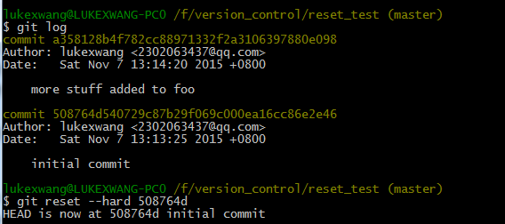
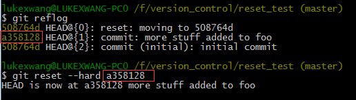

work space:是当前的文件夹，就是正在编辑的东西的文件夹；  
stage area:是指git add过的；  
reposity；是指git commit过的；
##windows  
在git bash中直接使用FC <file1> <file2>
###linux  
使用 git diff   
git diff 还可以比较**提交的**两个版本的不同:git diff <ID1> <ID2>  
如果直接比较两个文件的话使用：git diff（现在比较的是work space 和 stage area中的所有文件）
git diff <file1> 就是比较work space 和 stage area中的文件file1；  
如果是比较stage area和reposity中的file1，使用:git diff --staged   

git log：查看历史提交记录   
如果需要比较最近提交的两个版本的不同可以使用git log -p -2  
git reset --hard <ID的前7位> 回到某个提交历史。  
  
此时你再用vim去打开文件来看，全部都回到了以前你需要的版本。**（不过这种操作有一个问题，就是回去的时候会把你对所有文件的修改都倒回去）**  
这看起来我们是丢掉了我们第二次的提交，没有办法找回来了。但是 reflog 就是用来解决这个问题的。简单的说，它会记录所有HEAD的历史，也就是说当你做 reset，checkout等操作的时候，这些操作会被记录在reflog中。   
$git reflog  
  
查看所有分支：git branch  
创建新分支：git branch <new_branch_name>  
切换到分支：git checkout <branch_name>  
###撤销操作
-  **修改最后一次提交**  
有时候我们提交完了才发现漏掉了几个文件没有加，或者提交信息写错了。想要撤消刚才的提交操作，可以使用 --amend 选项重新提交：	  
git commit --amend  
此命令将**使用当前的暂存区域(stage area)快照提交**。如果刚才提交完没有作任何改动，直接运行此命令的话，**相当于有机会重新编辑提交说明**，但将要提交的文件快照和之前的一样。例如：<pre><code>
$git commit -m 'initial commit'
$git add forgotten_file
$git commit --amemd
</code></pre>
(发现了一个问题，这条语句好像只能用于添加，不能用于删除。而且很严重的一个问题是，git rm命令会将物理文件一起给rm掉)

-  取消已经暂存的文件（也就是取消git add 后的文件，或者说取消stage area中的文件）  
	  其实使用git status就可以看到一个git reset HEAD  file...  
	  使用了那个文件就不会再stage area中了。  

-  取消对文件的修改  
	对于在stage area中文件（也就是git add后的文件但是还没有git commit的文件），可以使用git checkout -- <file>来撤销对文件的修改  (这个命令，git status会有提示)  
###远程仓库的使用
 - 查看远程仓库： 
	 - git remote命令会列出指定的每个远程服务器的简写；如果你已经clone了自己的仓库，至少origin-这是git为你clone的仓库服务器的默认名字;
	 - git remote -v会显示需要读写远程仓库使用的GIT保存的简写以及其URL（如果是一个项目，有众多的贡献者，那么会被全部列出）如：  <pre><code>
	$ git remote -v
	bakkdoor  https://github.com/bakkdoor/grit (fetch)
	bakkdoor  https://github.com/bakkdoor/grit (push)
	cho45     https://github.com/cho45/grit (fetch)
	cho45     https://github.com/cho45/grit (push)
	defunkt   https://github.com/defunkt/grit (fetch)
	defunkt   https://github.com/defunkt/grit (push)
	koke      git://github.com/koke/grit.git (fetch)
	koke      git://github.com/koke/grit.git (push)
	origin    git@github.com:mojombo/grit.git (fetch)
	origin    git@github.com:mojombo/grit.git (push)	</code></pre>
	 -	git remote show [remote\_name]可以查看远程仓库更加详细的信息
###添加远程仓库
 -  git remote add <\shortname> <\url>可以添加一个新的远程仓库，同时制定一个你可以轻松引用的简写（**在我看来同一个项目可能很多人在开发，那么可定有很多人有仓库，那么在这同一个文件夹下，就可以把多个人的开发的仓库添加进来**）：<pre><code>
$ git remote add pb https://github.com/paulboone/ticgit
$ git remote -v
origin	https://github.com/schacon/ticgit (fetch)
origin	https://github.com/schacon/ticgit (push)
pb	https://github.com/paulboone/ticgit (fetch)
pb	https://github.com/paulboone/ticgit (push)
</code></pre> 
那么此时如果你想要从pb中拉去paul的仓库中含有但是自己仓库中没有信息就可以使用：git fetch pb<pre><code>
$ git fetch pb
remote: Counting objects: 43, done.
remote: Compressing objects: 100% (36/36), done.
remote: Total 43 (delta 10), reused 31 (delta 5)
Unpacking objects: 100% (43/43), done.
From https://github.com/paulboone/ticgit
 \* [new branch]      master     -> pb/master
 \* [new branch]      ticgit     -> pb/ticgit
</code></pre>
现在就可以paul的master分支就可以使用pb/master访问到。可以自己尝试一下git branch pb/master切换过去。当然可以将这个分支合并到自己的分支中。  
	 - git fetch [remote\_name]会去拉取分支但不会自动合并到自己的本地分支上；
	 - git pull [remote\_name] [local\_name] master不仅会去拉取分支还会将其合并到自己的本地分支上，运行 git pull 通常会从最初克隆的服务器上抓取数据并自动尝试合并到当前所在的分支。
	 - 默认情况下，git clone 命令会自动设置本地 master 分支跟踪克隆的远程仓库的 master 分支（或不管是什么名字的默认分支）；
###推送到远程仓库
 -  git push origin master  
 只有当你有所克隆**服务器的写入权限**，并且之前没有人推送过时，这条命令才能生效。 **当你和其他人在同一时间克隆，他们先推送到上游然后你再推送到上游，你的推送就会毫无疑问地被拒绝。 你必须先将他们的工作拉取下来并将其合并进你的工作后才能推送。**
###远程仓库的移除和重命名  
 - git remote rename pb pull
 - git remote rm [remote\_name]

